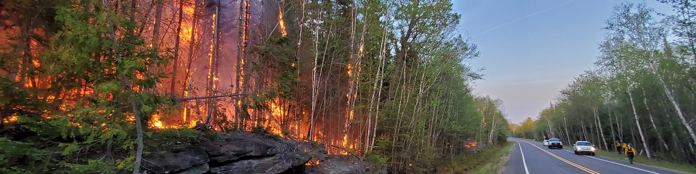
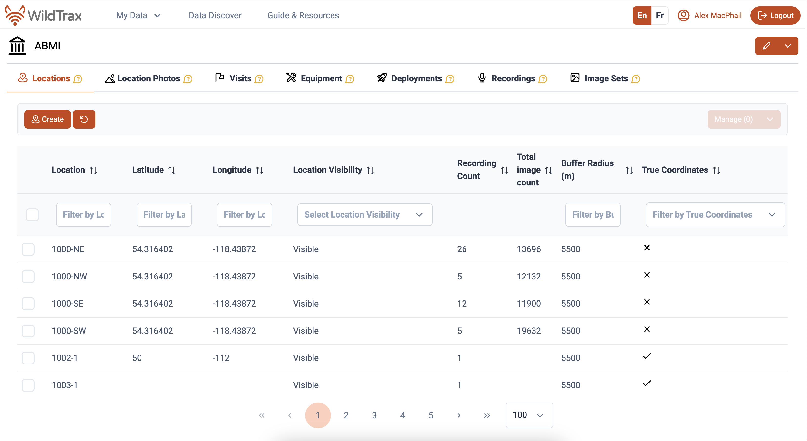

{style="float:left`;" fig-alt="Photo of a prescribed burn" fig-align="center"}

```{r}
#| label: Load packages and authenticate to WildTrax
#| include: false
#| echo: false
#| eval: true
#| warning: false
#| message: false

library(wildrtrax)
library(tidyverse)
library(sf)
library(vegan)
library(tinytex)
library(knitr)
library(leaflet)

load("pc-fire.RData")
#save.image("pc-fire.RData")

wt_auth()
```

```{r}
#| include: false
#| echo: false
#| eval: false
#| warning: false
#| message: false
# Download data

burn_projects <- c(2291, 282, 662, 672, 1092, 2021, 2878, 3577, 388, 1251, 1252, 1253, 1935, 2879, 2195, 2317, 2286, 2300, 2640, 2282, 3127, 4091, 3938, 3736, 3249, 2804, 4145)

einps <- wt_get_projects('ARU') |> filter(grepl('Elk Island',project), !project_id %in% burn_projects) |> pull(project_id)

burns_projects <- c(burn_projects, einps)

pf_fire_locs <- read_csv("PF-FINAL.csv") |>
  left_join(burns |> select(location, location_id) |> distinct(), by = c("location"))

burns <- wt_get_projects("ARU") |>
  filter(project_id %in% burn_projects) |>
  pull(project_id) |>
  wt_download_report('ARU', 'main') |>
  bind_rows() |>
  mutate(year = year(recording_date_time))

parks <- read_sf("./assets/National_Parks_and_National_Park_Reserves_of_Canada_Legislative_Boundaries.shp") |>
  st_transform(4326) |>
  st_make_valid()

parks_fire <- st_join(burn_sf, parks, join = st_intersects) |>
  dplyr::filter(!is.na(adminAreaI)) |>
  st_drop_geometry() |>
  select(adminAreaN) |>
  distinct() |>
  pull()

parks <- parks |> filter(adminAreaN %in% parks_fire)

burn_locs <- burns |>
  select(location, latitude, longitude) |>
  distinct() |>
  drop_na(latitude) |>
  st_as_sf(coords = c("longitude","latitude"), crs = 4326)

```

::: {.callout-note collapse="true" style="background-color: #f4f4f4; padding: 20px;"}
This report is dynamically generated, meaning its results may evolve with the addition of new data or further analyses. For the most recent updates, refer to the publication date and feel free to reach out to the authors.
:::

# Abstract

Ecologists use prescribed fire as a management tool to maintain and restore ecosystem structure, composition, and function, particularly in fire-adapted landscapes. In Canada’s national parks, prescribed fire is increasingly used to reduce fuel loads, promote habitat heterogeneity, protect communities, and support biodiversity objectives. However, understanding how bird communities respond to prescribed fire remains essential for evaluating both ecological benefits and potential impacts. Over the past seven years, Parks Canada has collected standardized bird survey data within prescribed fire areas across `r length(unique(burns$organization))` national parks, encompassing `r length(unique(burns$location))` sampling locations and approximately `r nrow(burns)` species observation records. This report presents summary analyses of these data to characterize migratory bird communities before and after prescribed fire in terms of species composition and richness, and functional diversity. The results are intended to help guide future bird monitoring efforts within Parks Canada for adaptive fire management practices.

# Land Acknowledgement

This work was conducted in national parks located on the traditional lands of Indigenous, First Nations and Métis Peoples who have stewarded these landscapes since time immemorial. We recognize and respect the enduring relationships Indigenous communities maintain with the land, water, and wildlife, and we acknowledge the value of Indigenous knowledge systems that continue to inform understanding, care, and management of these places today.

**Kluane**: We respectfully acknowledge that the lands of Kluane National Park Reserve where this study took place are the traditional territories of the Southern Tutchone people represented in the Kluane region by the Champagne and Aishihik First Nations and the Kluane First Nation. Champagne and Aishihik First Nations, Kluane First Nation and Parks Canada are jointly responsible for the management of Kluane’s natural and cultural resources.

**Bannf, Lake Louise, Yoho, Kootenay**: We respectfully acknowledge that Lake Louise, and Banff, Yoho and Kootenay National Parks, are located within the traditional lands of the Ktunaxa and Secwépemc peoples. We recognize their stewardship of the lands and waters in the area since time immemorial. Parks Canada is committed to reconciliation and renewed relationships with Indigenous peoples, based on a recognition of rights, respect, cooperation and partnership.

**Riding Mountain**: We respectfully acknowledge Riding Mountain National Park is located within Treaty 2 Territory and Parks Canada works with First Nations from Treaties 2, 4 and 1. We mention this to honor our relations and the contributions made to establish the park, the province, and Canada.

**Elk Island**: We acknowledge that Elk Island National Park is located within Amiskwaciy (Beaver Hills), a landscape that has been cared for and used by Indigenous peoples for thousands of years. We recognize the deep cultural, spiritual, and ecological connections Indigenous communities maintain with this land and affirm the importance of respecting Indigenous rights, knowledge, and stewardship in the ongoing care of this place.

**Prince Albert**: We respectfully acknowledge that Prince Albert National Park is located on Treaty 6 Territory, the traditional lands of the Cree, Dene, Dakota, Saulteaux, and Ojibwe peoples, and is within the homeland of the Métis.

**La Mauricie**: We respectfully acknowledge that La Mauricie National Park is part of the traditional territory of the Atikamekw Nation. For thousands of years, the Saint-Maurice River watershed and surrounding lakes were travelled and cared for by Indigenous Peoples, including the Atikamekw, who continue to maintain a deep and enduring relationship with this land.

**Pukaskwa**: 

**Grasslands**: We respectfully honour and acknowledge that Grasslands National Park is located on the traditional territory of the Niitsitapi, Nakoda, Cree, and Saulteaux nations, as well as the Métis Homeland. We recognize the deep historical and cultural connections these Indigenous peoples have to this land, which they have stewarded for generations, and we are committed to moving forward in the spirit of reconciliation, respect, and stewardship.

# Introduction

Ecologists use prescribed fire as a deliberate and carefully planned management practice to mimic natural disturbance regimes, reduce accumulated fuels, and promote ecological processes that sustain biodiversity. In many forested and grassland ecosystems, periodic fire plays a critical role in shaping vegetation structure, influencing habitat availability, and maintaining species assemblages. Prescribed fires are therefore widely used to support conservation objectives, particularly in protected areas where maintaining ecological integrity is a primary mandate. Within Parks Canada, prescribed fire is a key component of wildland fire management. The Parks Canada Fire Management Program coordinates fire management planning and operations across lands within the Parks Canada network, including the design and implementation of prescribed fires. While prescribed fire is expected to provide long-term ecological benefits, short- and medium-term responses of wildlife, particularly migratory birds, can vary depending on fire timing, intensity, extent, and pre-fire habitat conditions. As a result, systematic monitoring is required to evaluate both potential impacts and benefits of fire management actions.

Prescribed fire has a long history as a management tool in Canada, used to reduce fuel loads, restore fire-adapted ecosystems, and guide vegetation succession toward desired ecological states (@weber1992use). Research across forested and grassland systems shows that prescribed burning can substantially alter understory composition, soil seed banks, and habitat structure, with effects that vary by fire timing, intensity, and pre-disturbance conditions (@faivre2016prescribed; @travnicek2005fall). Beyond its biophysical effects, prescribed fire also operates within complex social and management contexts, shaping how landscapes are accessed, monitored, and interpreted by practitioners and researchers (@sutherland2019encountering). These interacting ecological and operational dimensions demonstrate the importance of targeted, long-term monitoring to evaluate wildlife responses, particularly for mobile taxa such as migratory birds, whose responses to fire may be transient, indirect, or delayed.

Over the past years, Parks Canada staff have conducted bird surveys within prescribed fire areas to assess how migratory bird communities respond to fire. This dataset provides an opportunity to examine changes in bird species composition, functional communities and richness before and after prescribed fire, as well as to evaluate variation across parks and fire events. The primary objective of this report is to describe and compare migratory bird communities before and after prescribed fire and to assess whether detectable differences are evident in species-level and community-level metrics. A secondary objective is to evaluate the sampling strategy used, including its capacity to characterize bird communities and its statistical power to detect or model changes associated with prescribed fire. The results of this work will support Parks Canada in interpreting the ecological outcomes of prescribed fire and in refining future monitoring and fire management practices.

# Methods

## Data collection

Data were collected using passive autonomous recording units (ARUs; @Shonfield2017) at `r length(unique(burns$location))` locations (@fig-aru-monitoring-locations) in 9 National Parks. 

```{r}
#| echo: false
#| eval: true
#| warning: false
#| message: false
#| include: true
#| fig-align: center
#| fig-cap: Locations surveyed for prescribed fire monitoring.
#| label: fig-aru-monitoring-locations

leaflet() |>
  addTiles() |>
  addPolygons(
    data = parks,
    popup = ~adminAreaN,
    fillOpacity = 0.4,
    color = "green"
  ) |>
  addCircleMarkers(
    data = burn_locs,
    popup = ~paste("Location:", location),
    fillOpacity = 1,
    color = "black",
    radius = 6
  ) |>
  addMeasure(primaryLengthUnit = "meters",
             primaryAreaUnit = "sqmeters") |>
  addMiniMap(position = "bottomleft")

```

Recordings were summarized by month and park to characterize the temporal distribution of sampling effort across each region and year (@fig-recordings-locations). Sampling occurred primarily during the breeding season (April–July), with the majority of effort concentrated in June. Temporal coverage varied among parks with sampling in single years and others sampled repeatedly across multiple years (@tbl-loc-summary). Monthly sample sizes ranged from low replication in some early or late-season deployments to higher levels of effort in core sampling months, reflecting differences in deployment timing, park-level logistics, and local program objectives.

```{r}
#| echo: false
#| eval: true
#| warning: false
#| message: false
#| include: true
#| fig-align: center
#| fig-cap: Locations from Jasper National Park ARU EI Monitoring Program.
#| label: fig-recordings-locations

burns |>
  distinct(organization, recording_id, recording_date_time) |>
  mutate(month = lubridate::floor_date(recording_date_time, "month")) |>
  count(organization, month) |>
  ggplot(aes(month, organization, fill = n)) +
  geom_tile() +
  scale_fill_viridis_c(name = "Count of Recordings", option = "plasma") +
  labs(
    x = "Month",
    y = "Park",
    title = "Temporal distribution of recording effort by Park"
  ) +
  scale_x_date(
    date_breaks = "1 year",
    date_labels = "%Y"
  ) +
  theme_bw()

```

## Data management and processing

The principal goal for data processing was to describe the acoustic community of species heard at locations while choosing a large enough subset of recordings for analyses. Data processing was completed in WildTrax with tags made using count-removal (see @farnsworth2002removal, @time-removal) where tags are only made at the time of first detection of each individual heard on the recordings (MacPhail et al. 2026 *In Review*). Multiple recording lengths were used in analysis relative to each national park (@fig-recordings-type) We also verified that all tags that were created were checked by a second observer (n = `r verified_tags |> select(Proportion) |> slice(2) |> pull()`) to ensure accuracy of detections. If amphibians were detected, abundance was estimated at the time of first detection using the [North American Amphibian Monitoring Program](https://www.usgs.gov/centers/eesc/science/north-american-amphibian-monitoring-program) with abundance of species being estimated on the scale of "calling intensity index" (CI) of 1 - 3. Mammals such as Red Squirrel, were also noted on the recordings. After the data are processed in WildTrax, the [wildrtrax](https://abbiodiversity.github.io/wildrtrax/) package was used to download the data into a standard format prepared for analysis. The `wt_download_report()` function downloads the data directly to a R framework for easy manipulation (see [wildrtrax APIs](https://abbiodiversity.github.io/wildrtrax/articles/apis.html)).

```{r}
#| echo: false
#| eval: true
#| warning: false
#| message: false
#| include: true
#| fig-align: center
#| fig-cap: Recording duration and method type collected from each national park. 1SPT refers to 1 species-individual per task and 1SPM refers to 1 species-individual per minute for the duration of the task.
#| label: fig-recordings-type

ggplot(burns, aes(x = organization, y = task_duration, color = task_method)) +
  geom_jitter(width = 0.2, height = 0, size = 3, alpha = 0.8) +
  labs(y = "Task Duration", x = "Organization", color = "Method") +
  theme_bw() +
  facet_wrap(~task_method, ncol = 1) +
  scale_colour_viridis_d(option = "plasma")

```

```{r}
#| include: false
#| echo: false
#| eval: true
#| warning: false
#| message: false

all_tags <- burns |> 
  tally() |>
  pull()

verified_tags <- burns |>
  group_by(tag_is_verified) |>
  tally() |>
  mutate(Proportion = round(n / all_tags,4)*100) |>
  rename("Count" = n) |>
  rename("Tag is verified" = tag_is_verified)

verified_tags

```

## Analysis

We compared species richness between pre-burn and post-burn surveys at locations of interest (@fig-paired). For each location, year, and sample type, richness was calculated as the number of unique species observed. Mean richness per location was then computed across years. Paired differences between pre- and post-burn richness were tested using a Wilcoxon signed-rank test. Data were visualized with lines connecting pre- and post-burn values for each location, points for individual observations, and median values highlighted to illustrate paired changes across burn events.

We examined how species abundance varied with time since fire and site characteristics (@fig-tsf). Data were filtered to include relevant columns and distinct observations of species and abundance. For visualization, total and mean species abundances were summarized by years since fire. To test for statistical effects, a generalized linear model (GLM) with a Poisson distribution was fit, using individual abundance as the response variable and years since fire, vegetation type, and fire frequency as explanatory variables. This approach allowed us to assess the influence of fire history and site characteristics on species abundance.

We used redundancy analysis (RDA) to examine how species composition varied with burn status and vegetation type (@fig-community). Data were restricted to locations of interest and to pre- and post-burn samples. For each location, year, sample type, and vegetation type, species abundances were calculated as the number of occurrences per species. Data were then converted to a site-by-species matrix, with missing species values filled as zero. RDA was performed using sample type and vegetation type as explanatory variables. Site scores and species scores were extracted for visualization. The resulting RDA plot displays sites colored by vegetation type, ellipses representing burn status, and species vectors illustrating associations with axes. This approach highlights shifts in community composition associated with fire and vegetation characteristics.

We calculated the Shannon diversity index for each surveyed location and year to quantify species diversity. Only vertebrate species (excluding mammals, amphibians, insects, abiotic, and unknown detections) were retained. For each recording, the maximum observed abundance per species was recorded. Data were then aggregated by location and year to produce a species-by-location abundance matrix. Shannon diversity was calculated from these totals using the `diversity` function, and results were combined with vegetation type metadata for each site. Diversity patterns across years were visualized and grouped by Park (@fig-shannon) Shannon diversity index was compared between pre-burn and post-burn surveys at each location. Only sites with known vegetation type and sample type were included (@fig-shannon-pre-post).

# Results

::: {.callout-note collapse="true" style="background-color: #f4f4f4; padding: 20px;"}
Some of these analyses are still a work-in-progress. Check back soon for updates and additional details.
:::

A summary of sampling locations and associated environmental covariates is provided in @tbl-paired. Across all paired stations, species richness did not differ significantly between pre- and post-burn conditions. A Wilcoxon signed-rank test detected no systematic directional shift in richness following fire (*V* = 19.5, *p* = 0.44), indicating that gains and losses were balanced across sites. Richness remained comparatively stable when aggregated across stations and study years (@fig-paired), suggesting that prescribed or natural burns did not produce a consistent short-term change in total species counts at the landscape scale.

When examining abundance trajectories within National Parks where both pre- and post-burn data were available, mean abundance trends were largely stable through time. The primary deviation from this pattern occurred in Riding Mountain National Park, where abundance increased notably between 3 and 12 years post-fire (@fig-tsf). This delayed response suggests a potential mid-successional effect, rather than an immediate post-disturbance pulse.

Despite the stability in richness and overall abundance, community composition exhibited divergence between pre- and post-burn states (@fig-community). Ordination patterns indicated contraction of species assemblages under post-burn conditions, consistent with a shift toward a more homogenized or filtered community structure. In other words, while total richness was maintained, the identity and relative contributions of species changed.

Patterns in Shannon’s diversity index mirrored the richness results. Elk Island National Park showed a non-significant decline in Shannon diversity following fire, whereas other parks displayed variable but non-directional trends across pre- and post-burn periods. When parks were evaluated independently, none exhibited a statistically significant decline in Shannon’s index attributable to burn state.

Collectively, these results indicate that fire did not consistently reduce species richness or diversity across parks, but it did alter community composition. The dominant signal of burn effects appears compositional rather than numeric, with structural reassembly occurring without broad-scale losses in diversity.

```{r}
#| include: true
#| echo: false
#| eval: true
#| warning: false
#| message: false
#| label: tbl-paired
#| tbl-cap: List of locations including vegetation type, year burned an frequency burned (total count of historical burns).

kable(pf_fire_locs |> select(-location_id))

```

```{r}
#| include: true
#| echo: false
#| eval: true
#| warning: false
#| message: false
#| label: fig-paired
#| fig-cap: Paired comparison of species richness before and after fire. Lines connect values from the same location, points show individual observations, and mean values are highlighted.

burns_fire <- burns |>
  left_join(pf_fire_locs |> select(location_id, veg_type, year_burned, freq_burned) |> distinct(), by = "location_id") |>
  mutate(ysf = year - year_burned)

burns_fire_paired <- burns_fire |>
  group_by(organization, location, location_id, year, ysf, year_burned, veg_type, freq_burned) |>
  summarise(richness = n_distinct(species_code), .groups = "drop") |>
  mutate(burn_status = case_when(ysf < 0 ~ "pre", ysf >=0 ~ "post", TRUE ~ "pre"), 
         burn_status = factor(burn_status, levels = c("pre", "post")))

# Plot
burns_fire_paired |>
  ggplot(aes(x = burn_status, y = richness, group = burn_status, fill = organization)) +
  geom_boxplot() +
  theme_bw() +
  facet_wrap(~organization) +
  ylab("Species richness") +
  scale_fill_viridis_d(option = "plasma") +
  xlab("Burn status")

```
```{r}
#| include: true
#| echo: false
#| eval: true
#| warning: false
#| message: false

paired_df <- burns_fire_paired |>
  filter(!is.na(burn_status)) |>
  group_by(location_id) |>
  summarise(
    pre_richness  = mean(richness[burn_status == "pre"], na.rm = TRUE),
    post_richness = mean(richness[burn_status == "post"], na.rm = TRUE),
    .groups = "drop"
  ) |>
  filter(!is.na(pre_richness) & !is.na(post_richness))  # keep only locations with both

# Wilcoxon signed-rank test (paired)
wilcox.test(paired_df$post_richness, paired_df$pre_richness, paired = TRUE)

```

```{r}
#| include: true
#| echo: false
#| eval: true
#| warning: false
#| message: false
#| label: fig-tsf
#| fig-cap: Species abundance in relation to years since fire.

tsf <- burns_fire |>
  select(organization, location, year, ysf, year_burned, freq_burned, veg_type, species_code, individual_order, abundance) |>
  distinct()

tsf_model <- glm_abundance <- glm(individual_order ~ ysf + veg_type + freq_burned,
                     family = poisson,
                     data = tsf)

tsf_summary <- tsf |>
  group_by(organization, ysf) |>
  summarise(
    total_abundance = max(individual_order),
    mean_abundance  = mean(individual_order),
    n_records       = n()
  ) |>
  ungroup() |>
  mutate(ysf = as.numeric(ysf))

ggplot(tsf_summary |> filter(!is.na(ysf)), 
       aes(x = ysf, y = mean_abundance, colour = organization)) +
  geom_point(size = 3) +          
  geom_smooth() +
  labs(
    x = "Years Since Fire",
    y = "Mean Abundance per Year since Fire",
  ) +
  theme_bw() +
  scale_colour_viridis_d(option = "plasma") +
  coord_cartesian(xlim = c(min(tsf_summary$ysf, na.rm = TRUE),
                           max(tsf_summary$ysf, na.rm = TRUE))) +
  facet_wrap(~organization, ncol = 1)


```

```{r}
#| include: true
#| echo: false
#| eval: true
#| warning: false
#| message: false
#| label: fig-community
#| fig-cap: Species community matrix by pre and post burn status

comm_long <- burns_fire |>
  inner_join(
    burns_fire_paired |>
      select(location_id, year, burn_status) |>
      distinct(),
    by = c("location_id", "year")
  ) |>
  filter(species_code != "NONE") |>
  group_by(organization, location, recording_date_time, burn_status, species_code) |>
  summarise(
    abundance = max(as.numeric(individual_order), na.rm = TRUE),
    .groups = "drop"
  )

comm_mat <- comm_long |>
  pivot_wider(
    names_from  = species_code,
    values_from = abundance,
    values_fill = 0
  )

multi_type <- comm_mat  |>
  dplyr::select(organization, location, recording_date_time, burn_status) |>
  distinct() |>
  drop_na()

t3 <- rda(comm_mat[,-c(1:4)] ~ burn_status, data = multi_type)
t3scores <- scores(t3, display = "sites") |>
  as.data.frame() |>
  rownames_to_column("site") |>
  bind_cols(multi_type)
t3vect <- scores(t3, display="species") |>
  as.data.frame() |>
  tibble::rownames_to_column("species_code")


plot_RDA <- ggplot(t3scores, aes(x = RDA1, y = PC1)) +
  geom_point(aes(colour = burn_status), alpha = 0.7, size = 3) +
  stat_ellipse(aes(colour = burn_status), type = "norm", level = 0.67, linewidth = 1) +
  geom_vline(xintercept = 0, linetype = 2, colour = "#A19E99") +
  geom_hline(yintercept = 0, linetype = 2, colour = "#A19E99") +
  geom_segment(data = t3vect, aes(x = 0, y = 0, xend = RDA1, yend = PC1), arrow = arrow(length = unit(0.2, "cm")), linewidth = 0.3, inherit.aes = FALSE) +
  # geom_text_repel(data = t3vect, aes(x = RDA1, y = PC1, label = species_code), size = 3, fontface = "italic", colour = "black", max.overlaps = 10, inherit.aes = FALSE) +
  theme_bw() +
  scale_colour_viridis_d(option = "plasma", end = 0.9) +
  labs(x = "RDA1", y = "PC1", title = "Species associations by burn status", colour = "Burn status") +
  theme(plot.title = element_text(hjust = 0.5, face = "bold"), legend.position = "right")

plot_RDA


```

```{r}
#| include: true
#| echo: false
#| eval: true
#| warning: false
#| message: false
#| label: fig-shannon
#| fig-cap: Shannon diversity index by location and year for park surveys

shannon_d <- burns_fire |> 
  wt_tidy_species(remove = c("mammal","amphibian","abiotic","insect","unknown"), zerofill = F) |>
  inner_join(wt_get_species() |> dplyr::select(species_code, species_class, species_order), by = "species_code") |>
  dplyr::select(organization, location, location_id, recording_date_time, species_code, species_common_name, individual_order, abundance) |>
  distinct() |>
  group_by(organization, location, location_id, recording_date_time, species_code, species_common_name) |>
  summarise(count = max(individual_order)) |>
  ungroup() |>
  pivot_wider(names_from = species_code, values_from = count, values_fill = 0) |>
  pivot_longer(cols = -(organization:species_common_name), names_to = "species", values_to = "count") |>
  group_by(organization, location, location_id, year = year(recording_date_time), species) |>
  summarise(total_count = sum(count)) |>
  ungroup() |>
  group_by(organization, location, location_id, year) |>
  summarise(shannon_index = diversity(total_count, index = "shannon")) |>
  ungroup() |>
  left_join(burns_fire_paired |> select(location_id, year, veg_type, burn_status) |> distinct(), by= c("location_id" = "location_id", "year" = "year"))
  
shannon_d |>
  filter(!is.na(shannon_index), !is.na(veg_type)) |>
  ggplot(aes(x = factor(year), y = shannon_index, fill = factor(year))) +
  geom_boxplot() +
  geom_point(alpha = 0.6, colour = "grey") +
  labs(x = "Year", y = "Shannon diversity index per location") +
  theme_bw() +
  guides(fill = guide_legend(title = "Year")) +
  scale_fill_viridis_d(alpha = 0.8, option = "plasma") +
  scale_x_discrete(breaks = function(x) x[seq(1, length(x), by = 2)]) +  # show every 2nd year
  facet_wrap(~ organization)


```

```{r}
#| include: true
#| echo: false
#| eval: true
#| warning: false
#| fig-height: 6
#| message: false
#| label: fig-shannon-pre-post
#| fig-cap: Shannon diversity index by burn status across surveyed locations

shannon_d |>
  ggplot(aes(x = burn_status, y = shannon_index, fill = burn_status)) +
  geom_jitter(width = 0.2, alpha = 0.3, color = "grey40") +
  geom_boxplot(outlier.shape = NA, alpha = 0.6) +
  facet_wrap(~ organization) +
  scale_fill_viridis_d(option = "plasma") +
  labs(
    x = "Burn status",
    y = "Shannon diversity index",
    fill = "Burn status",
    title = "Shannon diversity pre- and post-burn by park"
  ) +
  theme_bw() +
  theme(
    legend.position = "bottom"
  )

```

# Discussion and Recommendations

## Location metadata

Consistent site naming is essential for linking repeat surveys across years and ensuring data loads cleanly into WildTrax. Location names should follow a stable, documented convention that persists across seasons and years (e.g., EINP-MOS-3, AC-C2). This avoids fragmentation caused by ad-hoc renaming and allows records from different sampling periods to be reliably joined. Where possible, names should use a hierarchical structure, moving from broad to specific (e.g., project or region → sub-site → point → treatment). This structure supports automated grouping, summarization, and analysis without manual reconciliation. Do not include burn type, year, or post-burn state in the location name, as this information is managed separately in metadata. Including it directly in the name can create inconsistencies within WildTrax as different location names would be generated. However, each location can still store spatial coordinates, and locations can be merged as needed within the system.



## Recording frequency and duration

Prescribed burns typically occur outside the migratory breeding bird season; therefore, within-season pre- and post-burn surveys are generally not required. However, if a burn occurs during the breeding season (approximately May 15–July 15 across most surveyed parks), additional surveys should be conducted during both the breeding period and the subsequent post-breeding period (July 15–August 31) to capture potential immediate and short-term responses.

Both resident and migratory species may respond to changes in burn state. Migratory species, in particular, may temporarily avoid burned areas or pass through them, although empirical evidence remains limited. Long-term acoustic monitoring using stationary ARUs placed within or adjacent to burn areas provides an effective approach for assessing site use and changes in community composition over time.

Recording effort should be consistent across the park system to support comparability among sites and years. For single-visit point counts, a minimum of 11 minutes of recording per session is recommended, which includes buffer time for the observer to initiate and complete a 10-minute acoustic survey. For surveys using pre-programmed ARUs, we recommend a staggered recording schedule distributed across seasons (winter, spring, summer, and post-breeding) and times of day (@tbl-blocks).

Recordings are organized into blocks representing short (3–10 minute) sampling periods spread across the season and diurnal cycle. This staggered design balances logistical constraints with ecological coverage, providing a robust dataset for characterizing bird communities and evaluating responses before, during, and after prescribed fire events.

```{r}
#| include: true
#| echo: false
#| eval: true
#| warning: false
#| message: false
#| label: tbl-blocks
#| collapse: true
#| code-fold: true
#| tbl-cap: Recommendation for pre-programmed long-term ARU scheduling. Complements the Alberta Biodiversity Monitoring Institute's Ecosystem Health and Biodiversity Trajectories programs.

library(tidyverse)
library(knitr)
library(kableExtra)

# Define the daily recording times for each block (simplified)
daily_times <- tibble(
  blocks = 1:12,
  Daily_Times = list(
    c("00:00", "02:00"),        # Block 1
    c("05:37", "07:07"),        # Block 2
    c("12:00", "15:00"),        # Block 3
    c("21:10", "23:10"),        # Block 4
    c("00:00", "02:00"),        # Block 5 (example repeat, adjust as needed)
    c("05:37", "07:07"),        # Block 6
    c("12:00", "15:00"),        # Block 7
    c("21:10", "23:10"),        # Block 8
    c("00:00", "02:00"),        # Block 9
    c("05:37", "07:07"),        # Block 10
    c("12:00", "15:00"),        # Block 11
    c("21:10", "23:10")         # Block 12
  )
)

# # Summarize seasonal schedule
# recs_table <- abmib |>
#   filter(!is.na(blocks)) |>
#   group_by(blocks) |>
#   summarise(
#     Julian_Days = paste(range(julian), collapse = "-"),
#     Recording_min = unique(recs),
#     .groups = "drop"
#   ) |>
#   left_join(daily_times, by = "blocks") |>
#   arrange(blocks)
# 
# # Convert daily times to a single string per row for table
# recs_table <- recs_table |>
#   mutate(Daily_Times = map_chr(Daily_Times, ~ paste(.x, collapse = ", ")))
# 
# # Output nicely formatted table
# kable(recs_table)

```

## Burn severity

For a field-usable and repeatable approach to assessing burn severity, which is likely a strong indicator of bird community composition (@knaggs2020avian), the Composite Burn Index (CBI) provides a well-established framework. CBI is designed to characterize fire effects across vegetation and substrate layers in a way that is comparable among sites and directly compatible with remote-sensed burn severity products. Assessments are conducted within a defined plot, typically on the order of 10-30 m in diameter to align with common satellite pixel sizes. Observations are made across five vertical strata: (1) substrate (litter, duff, soil), (2) herbaceous and low shrub layers, (3) tall shrubs and saplings, (4) understory trees, and (5) dominant and co-dominant trees. Within each stratum, multiple attributes, such as vegetation mortality, soil exposure, and char height, are scored on a standardized 0–3 scale, where 0 represents unburned conditions and 3 indicates the highest severity. Scores are averaged within strata and then combined to produce a composite severity value for the plot. To ensure consistency and transparency, field assessments should be recorded on standardized scoring sheets and supported by photographs taken from fixed viewpoints. In practice, field sheets should capture plot identifiers that align with the site naming convention, GPS coordinates, date and time, and observer names, followed by structured scoring for each vegetation and substrate layer. Additional observations, such as maximum char height, the presence of unburned refugia, or evidence of fire skips, provide valuable context for interpretation. For operational use, composite scores can be grouped into simplified burn severity classes (unburned, low, moderate, high). These classes retain the ecological meaning of the underlying CBI scores while providing a clear, interpretable summary that can be readily linked to management objectives and remote sensing products.

## Site photos

Standardized site photos provide a rapid, repeatable method for documenting burn severity and habitat characteristics when a full Composite Burn Index (CBI) protocol is not practical in the field. When collected consistently, photo documentation supports post-hoc severity assessment, habitat classification, long-term monitoring, and quality control. Each plot requires a complete set of eight standardized photos taken from the plot centre:

* North, East, South, West (cardinal directions): taken at a consistent height (approximately 1–1.5 m above ground), aimed horizontally outward from plot centre. These capture mid- and understory vegetation conditions, char height on boles, surface fuel consumption, and general landscape context in each direction
* Canopy (straight up): Camera aimed vertically upward from plot centre to document canopy cover, crown scorch, crown consumption, and canopy openness. This photo is particularly useful for estimating crown fire severity and canopy closure change over time
* Nadir (straight down): Camera aimed vertically downward to capture ground surface conditions directly underfoot, including ash depth, soil char, litter and duff consumption, and any residual vegetation at the ground layer
* Setup photo: a photo of the plot marker, ARU unit, datasheet, or GPS unit showing the plot ID and relevant metadata. This confirms plot identity and provides a visual record linking the photo set to the correct location and date


